# DSO101 Assignment 1 — Deployment Report

**Module:** DSO101 — Full Stack Development
**GitHub:** https://github.com/Jigden18/SS2026_DSO101_02240343

---

## Application Overview

This is a full-stack Todo List application built with the following stack:

| Layer | Technology |
|-------|-----------|
| Frontend | Next.js, Tailwind CSS |
| Backend | Node.js, Express.js, Prisma ORM |
| Database | PostgreSQL |
| Testing | Jest, Supertest, React Testing Library |

The application supports creating, editing, deleting, and filtering tasks with priority levels and due dates.

---

## Part A — Docker Hub & Manual Render Deployment

### Overview

Part A involved packaging both services into Docker containers, pushing the images to Docker Hub using the student ID as the tag, setting up a managed PostgreSQL database on Render.com, and deploying the backend and frontend manually through the Render dashboard.

---

### Step 1 — Writing the Dockerfiles

Two Dockerfiles were created — one for the backend and one for the frontend.

The backend Dockerfile uses a single-stage build with `node:18-alpine`. OpenSSL was added because Prisma requires it and `node:18-alpine` does not include it by default.

```dockerfile
FROM node:18-alpine

RUN apk add --no-cache openssl

WORKDIR /app

COPY package*.json ./

RUN npm install

COPY . .

RUN npx prisma generate

EXPOSE 5000

CMD ["node", "server.js"]
```

The frontend Dockerfile uses a multi-stage build with `node:20-alpine`. Node 20 was required because Next.js 16 does not support Node 18. The `NEXT_PUBLIC_API_URL` is accepted as a build argument and baked into the compiled JavaScript at build time — this is necessary because Next.js resolves `NEXT_PUBLIC_` variables during `npm run build`, not at runtime.

```dockerfile
# Stage 1: build the Next.js application
FROM node:20-alpine AS builder

WORKDIR /app

COPY package*.json ./

RUN npm install --legacy-peer-deps

COPY . .

# Bake the backend URL into compiled JavaScript at build time
ARG NEXT_PUBLIC_API_URL
ENV NEXT_PUBLIC_API_URL=$NEXT_PUBLIC_API_URL

RUN npm run build

# Stage 2: production runner (smaller final image)
FROM node:20-alpine AS runner

WORKDIR /app

COPY --from=builder /app/package*.json ./
COPY --from=builder /app/.next ./.next
COPY --from=builder /app/node_modules ./node_modules

EXPOSE 3000

CMD ["npm", "start"]
```

`.dockerignore` files were created for both services to exclude `node_modules`, `.env` files, and other unnecessary files from the Docker build context.

---

### Step 2 — Logging In to Docker Hub

Docker Desktop was installed and the following command was run to authenticate:

```bash
docker login
```
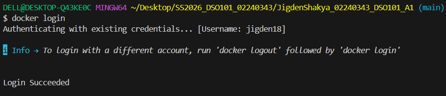
---

### Step 3 — Building the Backend Image

The backend image was built from inside the `backend/` folder:

```bash
docker build -t jigden18/be-todo:02240343 .
```
The build completed all 12 steps successfully. The new BuildKit output format shows `naming to docker.io/jigden18/be-todo:02240343` instead of the old `Successfully tagged` message.

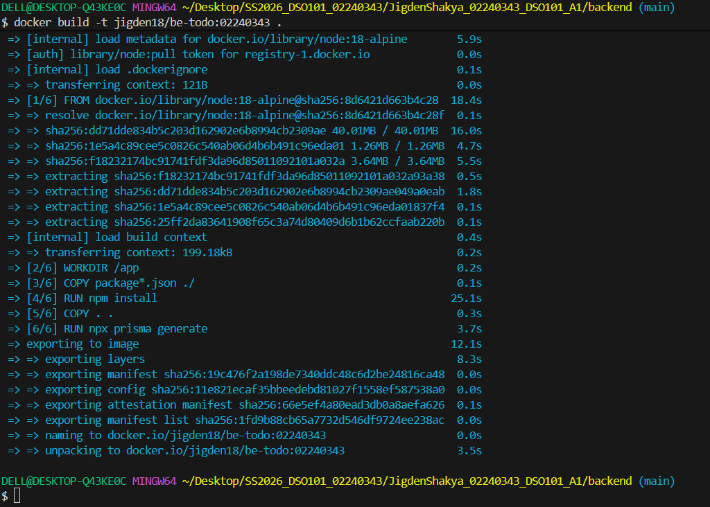

---

### Step 4 — Pushing the Backend Image

```bash
docker push jigden18/be-todo:02240343
```

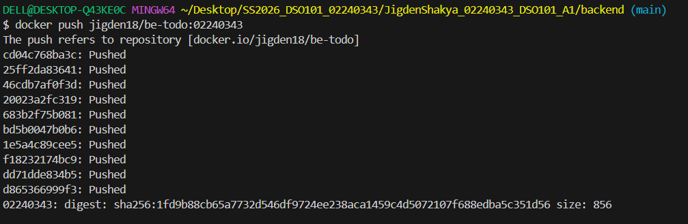


---

### Step 5 — Building the Frontend Image

The frontend image required the backend URL to be passed as a build argument so Next.js could compile it into the JavaScript bundle:

```bash
docker build --build-arg NEXT_PUBLIC_API_URL=https://be-todo-4977.onrender.com -t jigden18/fe-todo:02240343 .
```

Two issues were encountered during the frontend build:

1. **Node version mismatch** — Next.js 16 requires Node 20+. The Dockerfile was updated from `node:18-alpine` to `node:20-alpine`.
2. **Missing public folder** — `create-next-app` did not generate a `public/` folder. The `COPY public` line was removed from the Dockerfile.

After these fixes the build completed all 15 steps successfully.

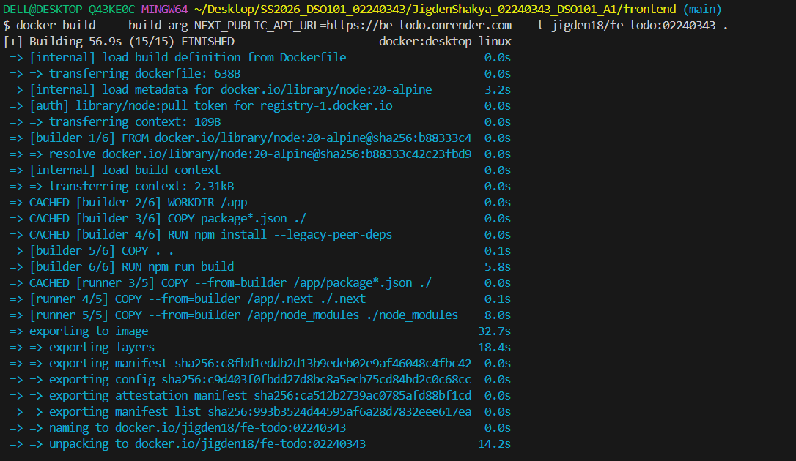

---

### Step 6 — Pushing the Frontend Image

```bash
docker push jigden18/fe-todo:02240343
```

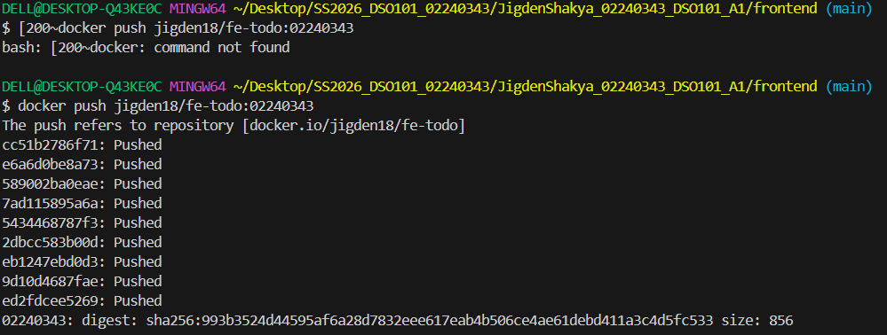

---

### Step 7 — Verifying Images on Docker Hub

Both images were confirmed on Docker Hub at `https://hub.docker.com/u/jigden18`.

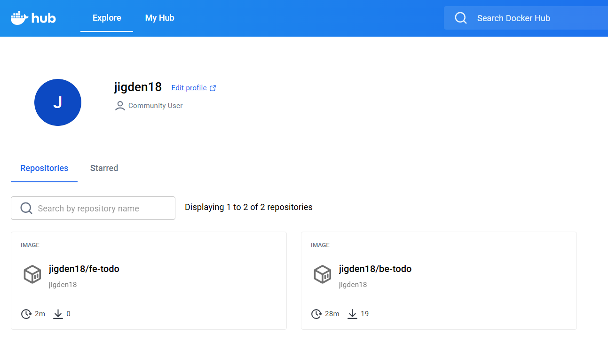

---

### Step 8 — Creating the PostgreSQL Database on Render

A free PostgreSQL database was created on Render with the following settings:

- Name: `todo-db`
- Database: `todo_db`
- Region: Singapore
- Version: 17
- Plan: Free

The Internal Database URL was copied from the Connections section for use as `DATABASE_URL` in the backend service.

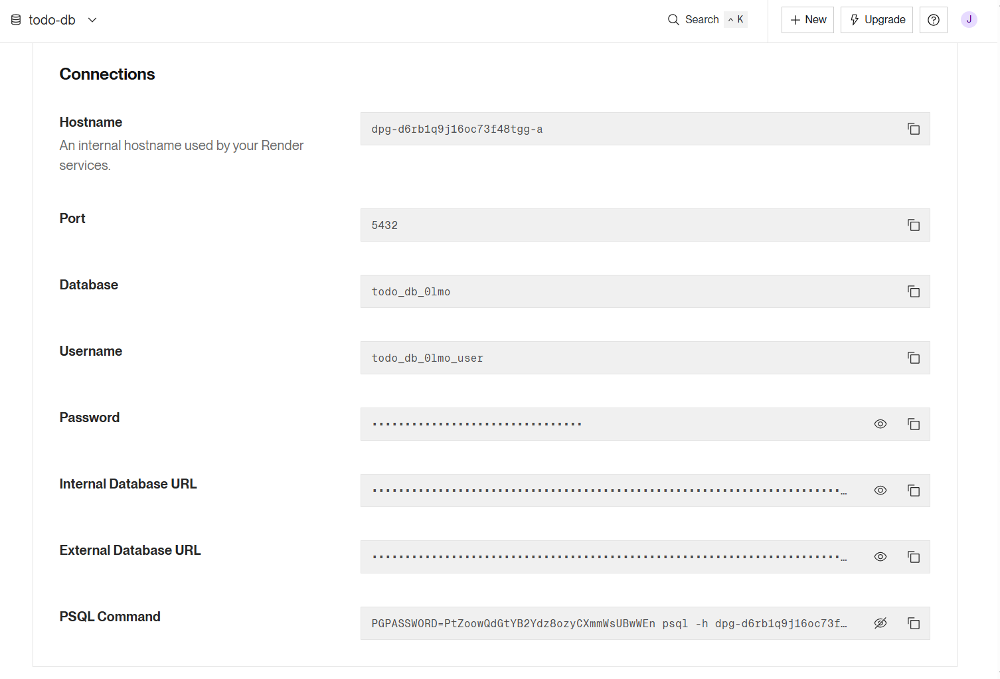

---

### Step 9 — Deploying the Backend on Render

A new Web Service was created on Render by selecting **"Deploy an existing image from a registry"** and entering the image URL:

```
docker.io/jigden18/be-todo:02240343
```

The following environment variables were set:

| Key | Value |
|-----|-------|
| `DATABASE_URL` | Internal Database URL from Render PostgreSQL |
| `PORT` | `5000` |
| `NODE_ENV` | `production` |
| `FRONTEND_URL` | `https://fe-todo-hvz4.onrender.com` |

The first deployment failed with a Prisma error:

```
Error loading shared library libssl.so.1.1: No such file or directory
```

This was fixed by adding `RUN apk add --no-cache openssl` to the backend Dockerfile, rebuilding, and pushing the updated image.

A second issue was that port 5432 was blocked on the local network so Prisma migrations could not be run from the local machine. This was solved by adding a `start.sh` script that runs `npx prisma migrate deploy` and `npx prisma db seed` automatically when the container starts.

After redeploying, the logs confirmed the server was running:

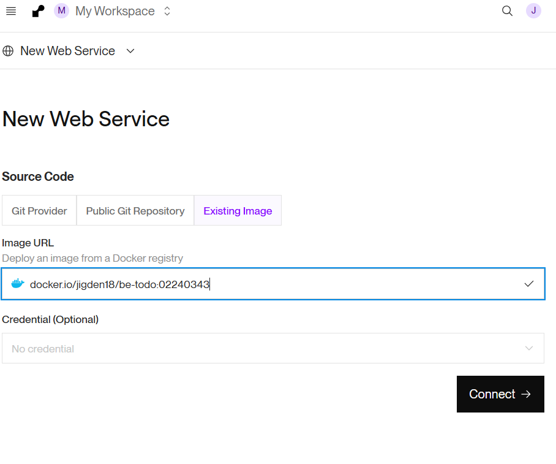

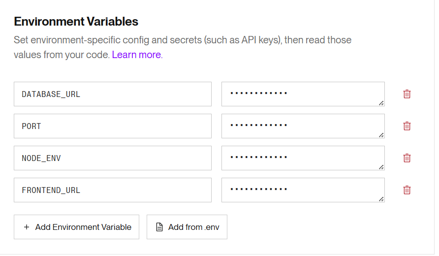

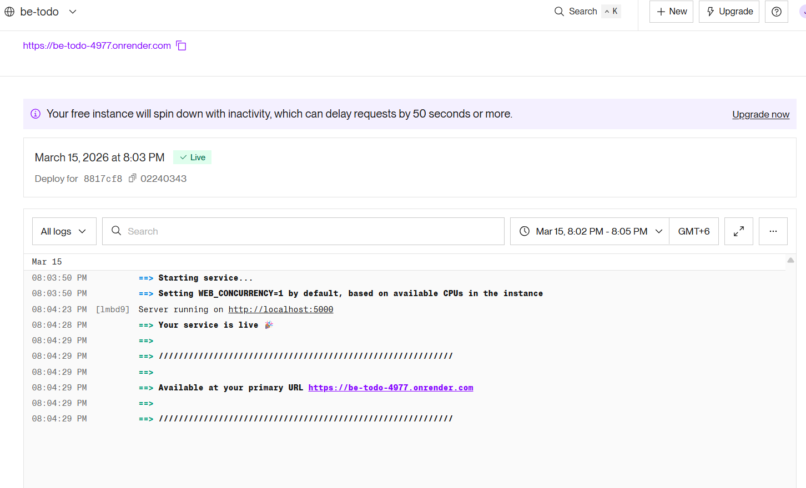

The backend was tested by visiting the live API URL:

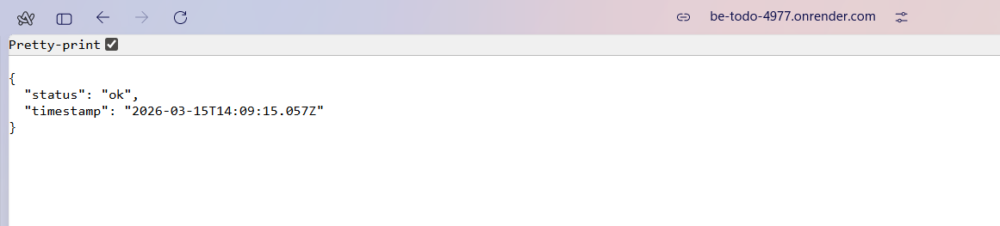

---

### Step 10 — Deploying the Frontend on Render

The frontend was deployed the same way using:

```
docker.io/jigden18/fe-todo:02240343
```

Environment variable set:

| Key | Value |
|-----|-------|
| `NEXT_PUBLIC_API_URL` | `https://be-todo-4977.onrender.com` |

Two issues were encountered:

1. **Wrong backend URL baked into the image** — The image was initially built with `https://be-todo.onrender.com` but the actual deployed URL was `https://be-todo-4977.onrender.com`. The frontend image was rebuilt and repushed with the correct URL.
2. **CORS error** — The frontend loaded but showed "No response from server". The browser dev tools showed the `FRONTEND_URL` environment variable on the backend had a trailing slash. Removing the trailing slash fixed it immediately.

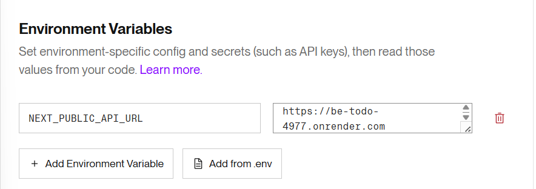

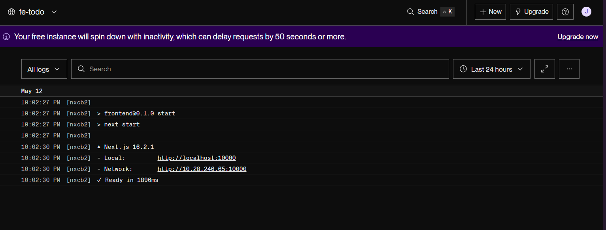


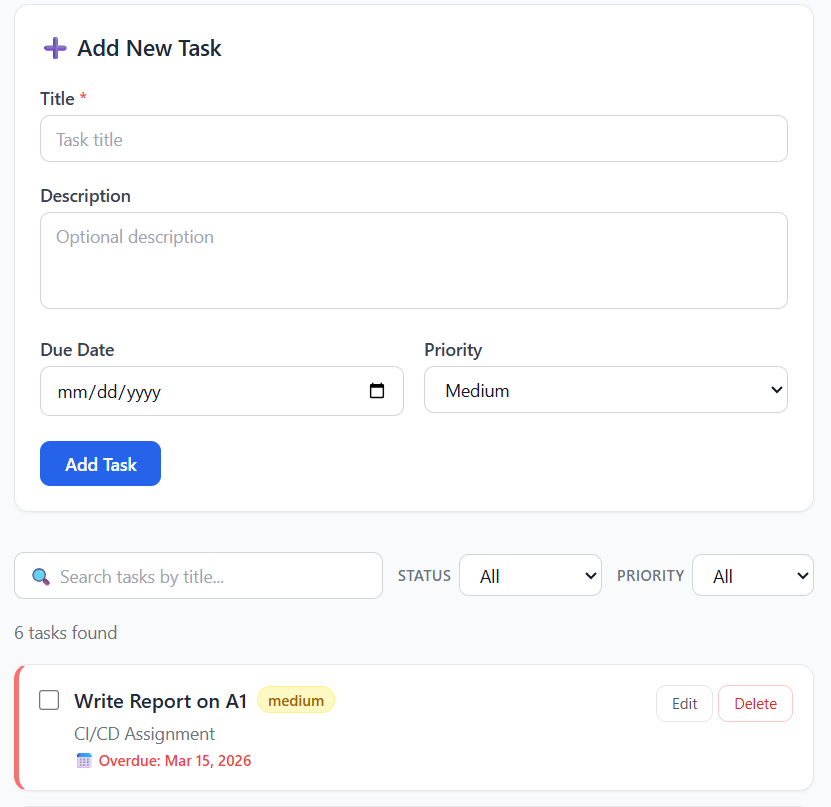


---

### Part A — Live URLs

| Service | URL |
|---------|-----|
| Frontend | https://fe-todo-hvz4.onrender.com |
| Backend API | https://be-todo-4977.onrender.com |
| Health check | https://be-todo-4977.onrender.com/health |
| Tasks API | https://be-todo-4977.onrender.com/api/tasks |

### Part A — Docker Images

| Service | Image | Tag |
|---------|-------|-----|
| Backend | jigden18/be-todo | 02240343 |
| Frontend | jigden18/fe-todo | 02240343 |

---

---

## Part B — Automated CI/CD via render.yaml Blueprint

### Overview

Part B set up automated deployment directly from the GitHub repository. A `render.yaml` Blueprint file was configured so that every time a commit is pushed to the main branch, Render automatically pulls the latest code, builds fresh Docker images from the Dockerfiles in the repo, and redeploys all services — no manual steps required after the initial setup.

---

### Step 1 — Creating the render.yaml File

A `render.yaml` file was created at the root of the GitHub repository. Because the project folder (`JigdenShakya_02240343_DSO101_A1/`) sits one level inside the repo, the `dockerfilePath` and `dockerContext` values include the full path from the repo root.

The `databases` block was removed after discovering that Render's free tier only allows one database at a time — the existing `todo-db` from Part A was reused by hardcoding the External Database URL directly.

New service names (`be-todo-github` and `fe-todo-github`) were used to avoid conflicts with the existing Part A services.

```yaml
# render.yaml — Render Blueprint
# On every git push to main, Render rebuilds and redeploys automatically.

services:
  # ── BACKEND ──────────────────────────────────────────────────────────────
  - type: web
    name: be-todo-github
    runtime: docker
    branch: main
    dockerfilePath: ./JigdenShakya_02240343_DSO101_A1/backend/Dockerfile
    dockerContext: ./JigdenShakya_02240343_DSO101_A1/backend
    region: singapore
    plan: free
    envVars:
      - key: DB_HOST
        sync: false
      - key: DB_USER
        sync: false
      - key: DB_PASSWORD
        sync: false
      - key: DB_NAME
        sync: false
      - key: DB_PORT
        value: "5432"
      - key: DB_SSL
        value: "true"
      - key: DATABASE_URL
        sync: false
      - key: PORT
        value: "5000"
      - key: NODE_ENV
        value: production
      - key: FRONTEND_URL
        value: https://fe-todo-github.onrender.com

  # ── FRONTEND ─────────────────────────────────────────────────────────────
  - type: web
    name: fe-todo-github
    runtime: docker
    branch: main
    dockerfilePath: ./JigdenShakya_02240343_DSO101_A1/frontend/Dockerfile
    dockerContext: ./JigdenShakya_02240343_DSO101_A1/frontend
    region: singapore
    plan: free
    envVars:
      - key: NEXT_PUBLIC_API_URL
        value: https://be-todo-github.onrender.com
```

---

### Step 2 — Pushing render.yaml to GitHub

The file was committed and pushed to the repository root:

```bash
git add render.yaml
git commit -m "feat: add render.yaml Blueprint for CI/CD deployment"
git push origin main
```

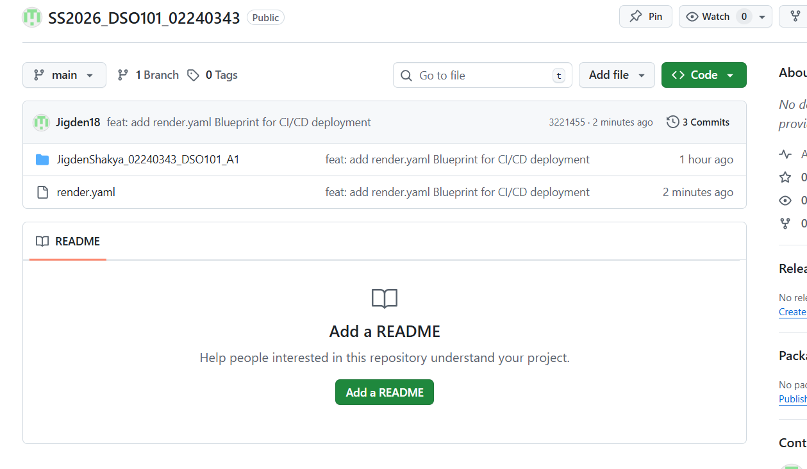

---

### Step 3 — Connecting GitHub to Render via Blueprint

Several issues were encountered during the Blueprint setup:

- **`buildArgs` not supported** — The `buildArgs` field was not valid in Render's Blueprint spec and was removed
- **`user: postgres` not valid** — Render does not allow `postgres` as a database username. Changed to `todo_user`
- **Cannot have two free databases** — The `databases` block was removed since `todo-db` already existed from Part A
- **Cannot associate image-based services with Git-based Blueprint** — Render does not allow converting an existing image-based service to a Git-based one through Blueprint association. New services with different names were created instead

After resolving all issues, the Blueprint was connected through Render → **New** → **Blueprint** → select `SS2026_DSO101_02240343` → **Create all as new services** → **Apply**.


---

### Step 4 — Monitoring the Deployment

Render built both Docker images directly from the GitHub repository — unlike Part A where pre-built images were pushed from a local machine. Each service's Logs tab showed the Docker build steps completing and the services starting.

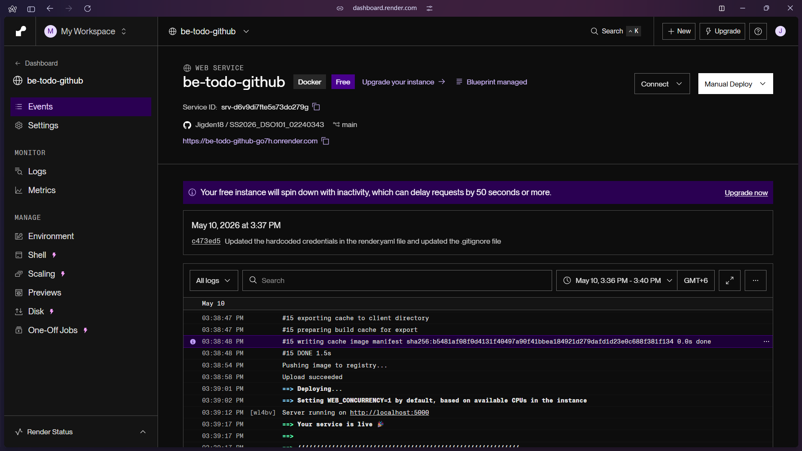

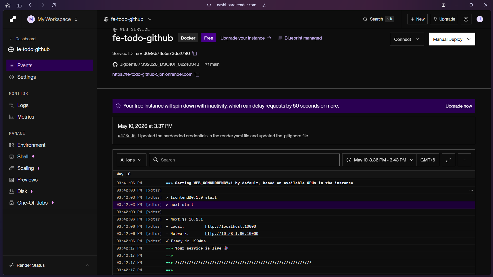

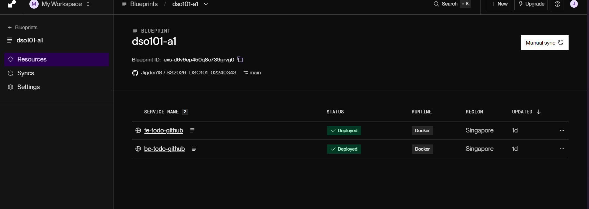


---

### Step 5 — Fixing CORS After Blueprint Deployment

After the Blueprint deployed, the frontend showed "No response from server". The `FRONTEND_URL` on the backend service was updated to `https://fe-todo-github.onrender.com` without a trailing slash, which resolved the CORS error.

---

### Part B — Live URLs

| Service | URL |
|---------|-----|
| Frontend (Git-based) | https://fe-todo-github.onrender.com |
| Backend API (Git-based) | https://be-todo-github.onrender.com |

---

### Part B — How render.yaml Works

The `render.yaml` file acts like a `docker-compose.yml` for Render's cloud platform. It describes all services in one place — their Dockerfile paths, environment variables, region, and plan. Once connected to GitHub via the Blueprint feature, Render registers a webhook on the repository. Every push to the main branch fires the webhook and Render automatically rebuilds and redeploys all services defined in the file.

The key difference from Part A is:

| Part A | Part B |
|--------|--------|
| Images built locally and pushed to Docker Hub | Images built by Render from the GitHub repo |
| Deployed by pasting image URL in Render dashboard | Deployed automatically on every git push |
| Manual redeploy needed for every code change | Zero manual steps after initial setup |

---

## Challenges Faced

**OpenSSL missing in Alpine** — `node:18-alpine` does not include OpenSSL which Prisma requires. Fixed by adding `RUN apk add --no-cache openssl` to the backend Dockerfile.

**Node version mismatch** — Next.js 16 requires Node 20+. Fixed by switching the frontend Dockerfile from `node:18-alpine` to `node:20-alpine`.

**Port 5432 blocked** — The university network blocks outbound connections to port 5432, preventing Prisma migrations from being run locally against the Render database. Fixed by adding a `start.sh` startup script that runs migrations automatically inside Render's network when the container starts.

**NEXT_PUBLIC_ baked at build time** — When the wrong backend URL was used as the build argument, changing the environment variable on Render had no effect. The frontend image had to be rebuilt and repushed with the correct URL.

**CORS trailing slash** — The `FRONTEND_URL` environment variable on the backend had a trailing slash which caused CORS to reject all frontend requests. Removing the trailing slash fixed it.

**Blueprint limitations** — Render's Blueprint cannot convert an existing image-based service to a Git-based one. New services with different names had to be created for Part B alongside the existing Part A services.

**Free tier database limit** — Render's free tier only allows one active PostgreSQL database. The `databases` block was removed from `render.yaml` and the existing database from Part A was reused.


---

## References

- Docker — Build and push: https://docs.docker.com/get-started/introduction/build-and-push-first-image/
- Render — Deploying an image: https://render.com/docs/deploying-an-image
- Render — Blueprint spec: https://render.com/docs/blueprint-spec
- Render — Environment variables: https://render.com/docs/configure-environment-variables
- Prisma — Deploy migrations: https://www.prisma.io/docs/orm/prisma-migrate/workflows/deploying-migrations