# Assignment II

**Continuous Integration and Continuous Deployment (DSO101)**  
**Bachelor's of Engineering in Software Engineering (SWE)**  


## Objective

To configure a **Jenkins pipeline** to automate the **build, test**, and **deployment** of the to-do list application from Assignment 1 with the following stages:

- Code checkout from GitHub
- Dependency installation (`npm`)
- Build step
- Unit testing (Jest)
- Deployment (Docker)

---

## Tools & Technologies

| Tool | Purpose |
|------|---------|
| Jenkins | CI/CD automation |
| GitHub | Source code hosting |
| Node.js & npm | JavaScript runtime & package manager |
| Jest + jest-junit | Testing framework with JUnit reporting |
| Docker | Containerization |
| Docker Hub | Container image registry |
| Render PostgreSQL | Cloud database |

---

## Step-by-Step Tasks

### Task 1: Jenkins Setup for Node.js

1. **Install Jenkins**
   - Download from: [https://jenkins.io/download](https://jenkins.io/download)
   - Run on: `localhost:8080`

2. **Install Required Plugins**
   Navigate to `Manage Jenkins > Plugins > Available` and install:
   - NodeJS Plugin
   - Pipeline
   - GitHub Integration
   - Docker Pipeline

3. **Configure Node.js**
   - Go to: `Manage Jenkins > Tools > NodeJS`
   - Add Node.js (LTS v20.x)

---

### Task 2: GitHub Repository Setup

1. Using the same repository as Assignment 1:
   **[SS2026_DSO101_02240343](https://github.com/Jigden18/SS2026_DSO101_02240343.git)**

2. **Generate GitHub Personal Access Token (PAT)**
   - Go to: `GitHub > Settings > Developer Settings > Personal Access Tokens`
   - Create token with `repo` and `admin:repo_hook` permissions

   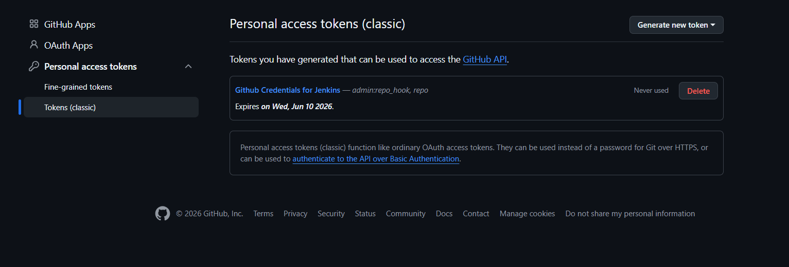

3. **Add GitHub Credentials in Jenkins**
   - Go to: `Manage Jenkins > Credentials > Add Credentials`
   - Type: Username & Password
   - Username: `Jigden18`
   - Password: Your PAT ( Personal Access Token )
   - ID: `github-credentials`

   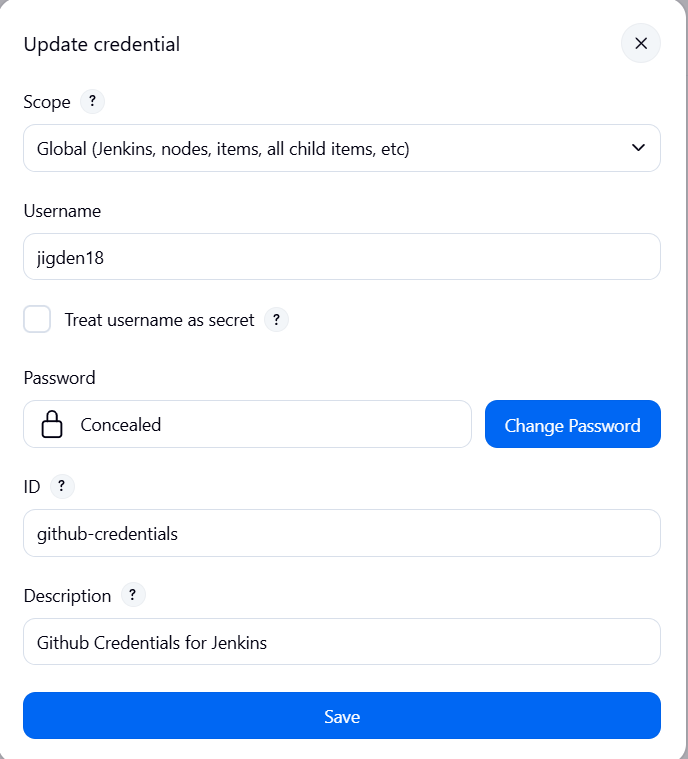

---

### Task 3: Configure Render Database URL

1. Go to **Render Dashboard → your PostgreSQL service → Connect → External Database URL**
2. Copy the external connection string
3. Add it to Jenkins:
   - Go to: `Manage Jenkins > Credentials > Add Credentials`
   - Type: Secret text
   - Secret: Your Render external database URL
   - ID: `render-database-url`

   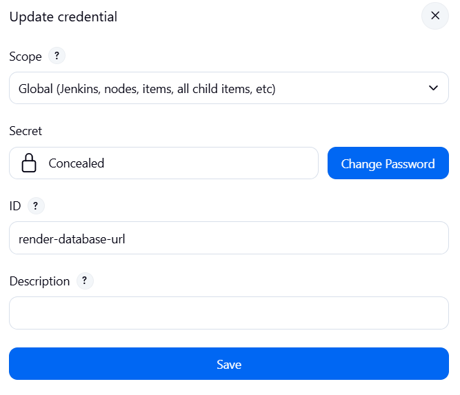

---

### Task 4: Configure Docker Hub Credentials

1. Go to **Docker Hub → Account Settings → Security → Access Tokens**
2. Generate a new token with Read/Write permission
3. Add to Jenkins:
   - Go to: `Manage Jenkins > Credentials > Add Credentials`
   - Type: Username & Password
   - Username: `jigden18`
   - Password: Your Docker Hub access token
   - ID: `docker-hub-creds`

   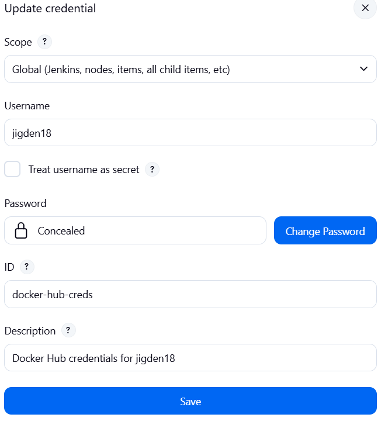

---

### Task 5: Jenkinsfile

Create a `Jenkinsfile` in the root of your repository:

```groovy
pipeline {
    agent any

    tools {
        nodejs 'NodeJs'
    }

    environment {
        DOCKERHUB_USERNAME  = 'jigden18'
        BE_IMAGE            = 'jigden18/be-todo:latest'
        FE_IMAGE            = 'jigden18/fe-todo:latest'
        BE_DIR              = 'JigdenShakya_02240343_DSO101_A1/backend'
        FE_DIR              = 'JigdenShakya_02240343_DSO101_A1/frontend'
        NEXT_PUBLIC_API_URL = 'https://be-todo-github-go7h.onrender.com'
        DATABASE_URL        = credentials('render-database-url')
    }

    stages {

        // Stage 1: Checkout Code
        stage('Checkout') {
            steps {
                git branch: 'main',
                    url: 'https://github.com/Jigden18/SS2026_DSO101_02240343.git'
            }
        }

        // Stage 2: Install Backend Dependencies
        stage('Install Backend') {
            steps {
                dir("${BE_DIR}") {
                    bat 'npm install'
                }
            }
        }

        // Stage 3: Install Frontend Dependencies
        stage('Install Frontend') {
            steps {
                dir("${FE_DIR}") {
                    bat 'npm install --legacy-peer-deps'
                }
            }
        }

        // Stage 4: Build Frontend
        stage('Build') {
            steps {
                dir("${FE_DIR}") {
                    bat 'npm run build'
                }
            }
        }

        // Stage 5: Run Backend Unit Tests
        stage('Test Backend') {
            steps {
                dir("${BE_DIR}") {
                    bat 'npm test'
                }
            }
            post {
                always {
                    junit allowEmptyResults: true,
                          testResults: "${BE_DIR}/junit.xml"
                }
            }
        }

        // Stage 6: Run Frontend Unit Tests
        stage('Test Frontend') {
            steps {
                dir("${FE_DIR}") {
                    bat 'npm test'
                }
            }
            post {
                always {
                    junit allowEmptyResults: true,
                          testResults: "${FE_DIR}/junit.xml"
                }
            }
        }

        // Stage 7: Build and Push Backend Docker Image
        stage('Deploy Backend') {
            steps {
                dir("${BE_DIR}") {
                    script {
                        docker.withRegistry(
                            'https://registry.hub.docker.com',
                            'docker-hub-creds'
                        ) {
                            def beImage = docker.build("${BE_IMAGE}")
                            beImage.push()
                        }
                    }
                }
            }
        }

        // Stage 8: Build and Push Frontend Docker Image
        stage('Deploy Frontend') {
            steps {
                dir("${FE_DIR}") {
                    script {
                        docker.withRegistry(
                            'https://registry.hub.docker.com',
                            'docker-hub-creds'
                        ) {
                            def feImage = docker.build(
                                "${FE_IMAGE}",
                                "--build-arg NEXT_PUBLIC_API_URL=${NEXT_PUBLIC_API_URL} ."
                            )
                            feImage.push()
                        }
                    }
                }
            }
        }
    }

    post {
        success {
            echo 'Pipeline completed — both images pushed to Docker Hub.'
        }
        failure {
            echo 'Pipeline failed. Check the stage logs above.'
        }
    }
}
```

#### The pipeline performs the following:

1. **Checkout** — Clones the project from GitHub
2. **Install Dependencies** — Runs `npm install` for backend and frontend
3. **Build** — Builds the Next.js frontend
4. **Test** — Runs Jest tests for both backend and frontend with JUnit reporting
5. **Deploy** — Builds and pushes Docker images to Docker Hub


---

### Task 6: Create Jenkins Pipeline Job

1. Go to **Jenkins Dashboard → New Item**
2. Enter name (e.g., `A1-Pipeline`) → Select `Pipeline` → Click `OK`
3. Under **Pipeline** section:
   - Definition: `Pipeline script from SCM`
   - SCM: `Git`
   - Repository URL: `https://github.com/Jigden18/SS2026_DSO101_02240343.git`
   - Credentials: `github-credentials`
   - Branch: `*/main`
   - Script Path: `Jenkinsfile`
4. Click **Save → Build Now**

---

### Task 7: Pipeline Execution

**Successful pipeline run:**

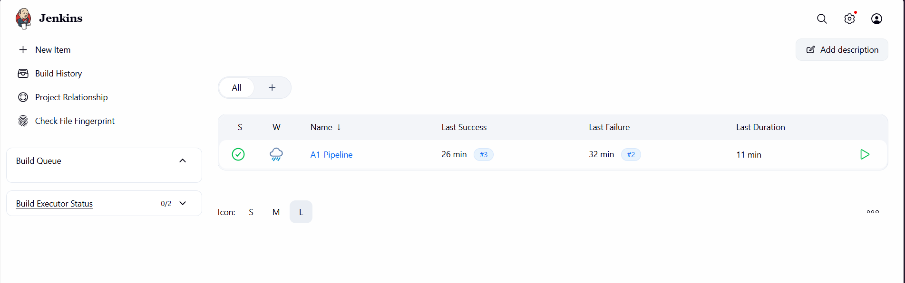

**Stage-by-stage execution:**

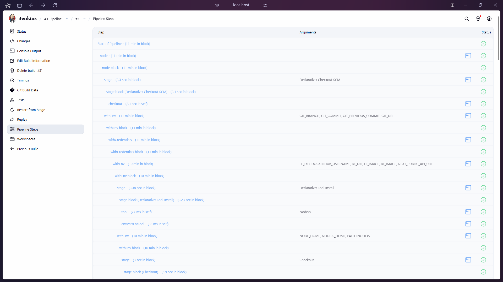

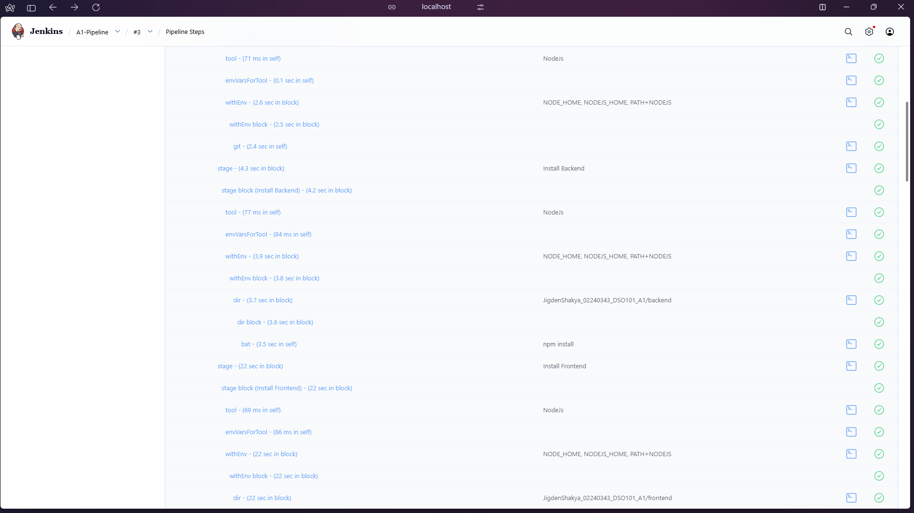

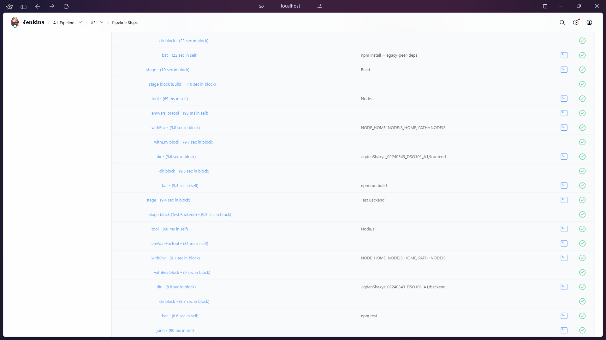

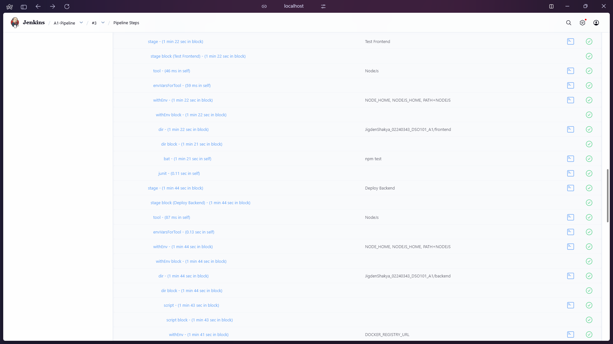

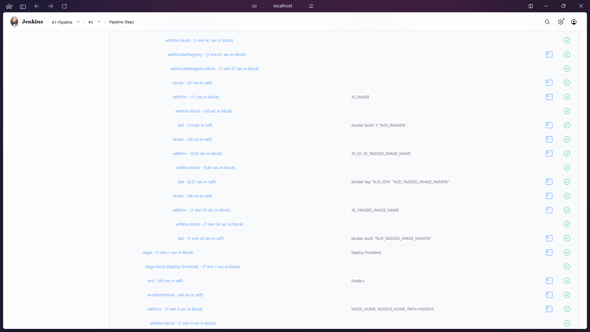

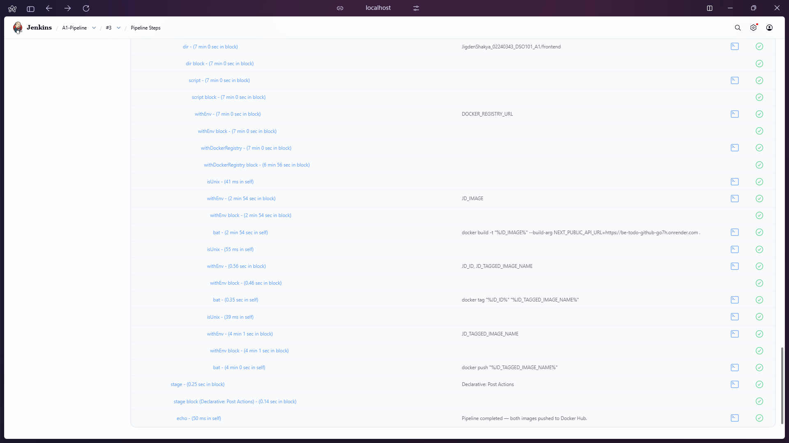

---

### Task 8: Docker Hub Images

**Backend image pushed to Docker Hub:**

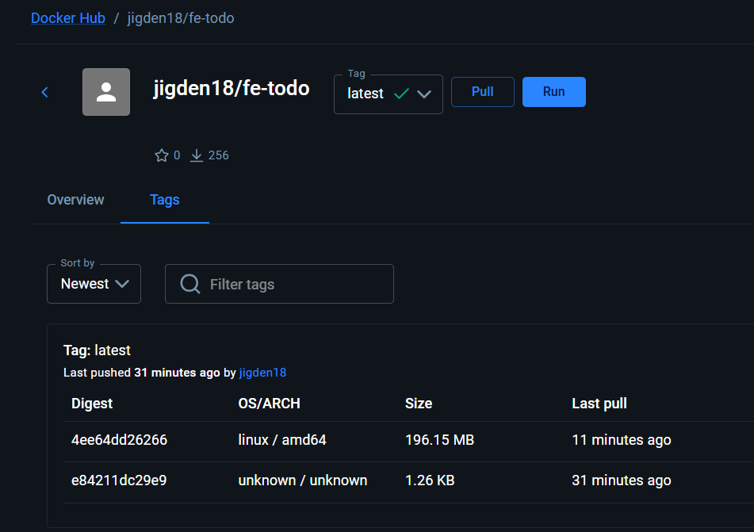

**Frontend image pushed to Docker Hub:**

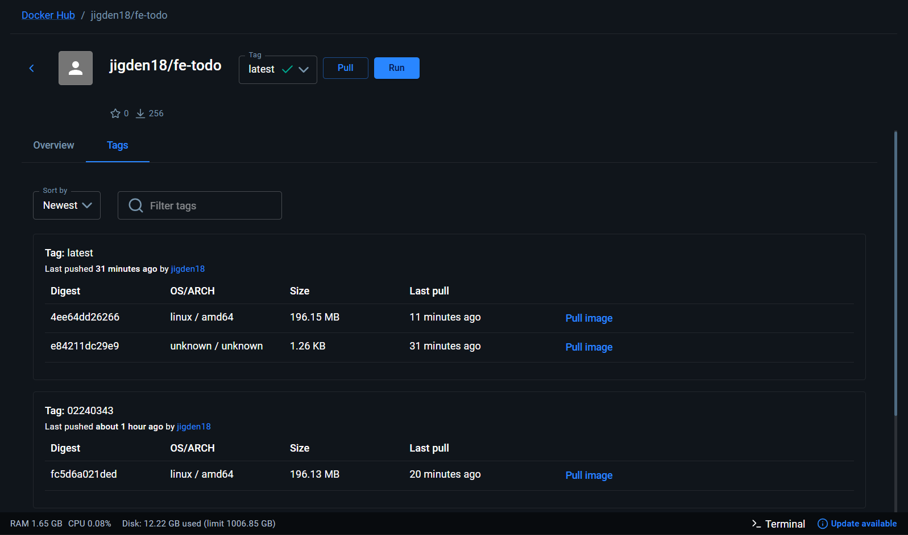

---

## Challenges Faced

### 1. Campus WiFi Blocking Port 5432
The college network blocks outbound connections on port 5432 (PostgreSQL), causing backend tests to fail with `Can't reach database server`. 

**Fix:** Switched to mobile hotspot when running the pipeline so Prisma could connect to the Render PostgreSQL database.