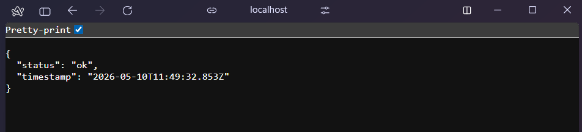
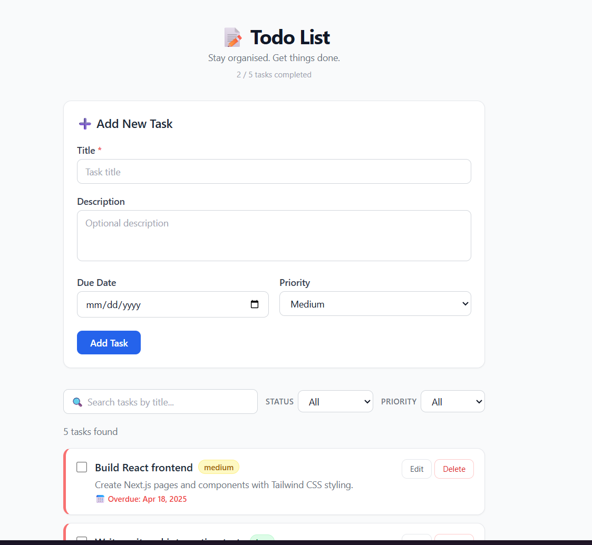
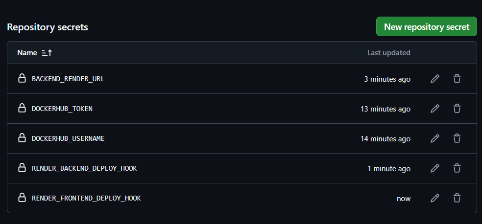
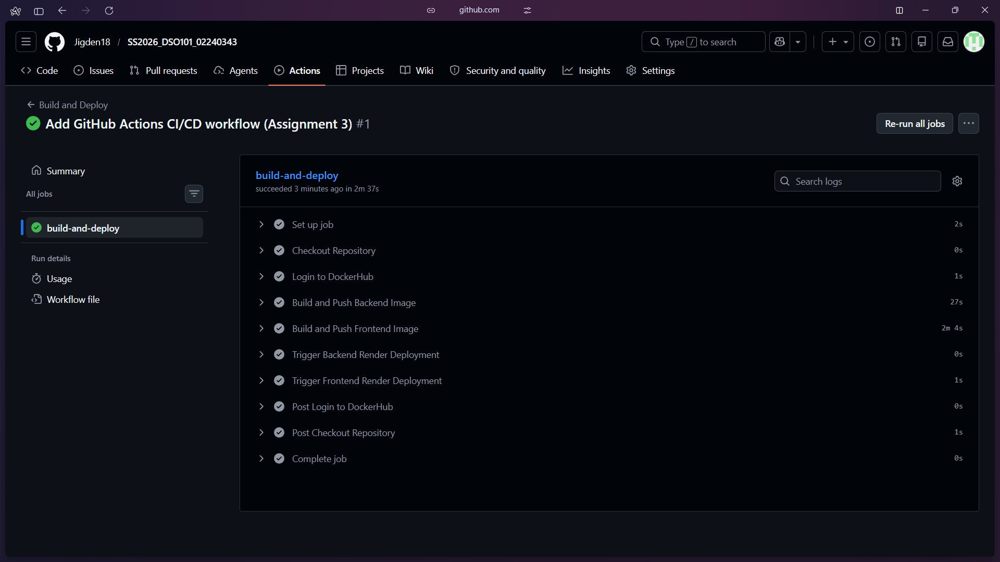
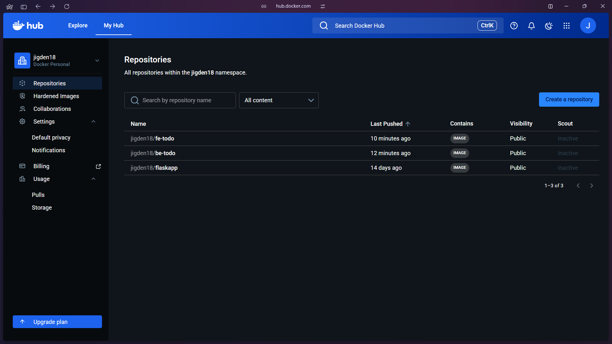
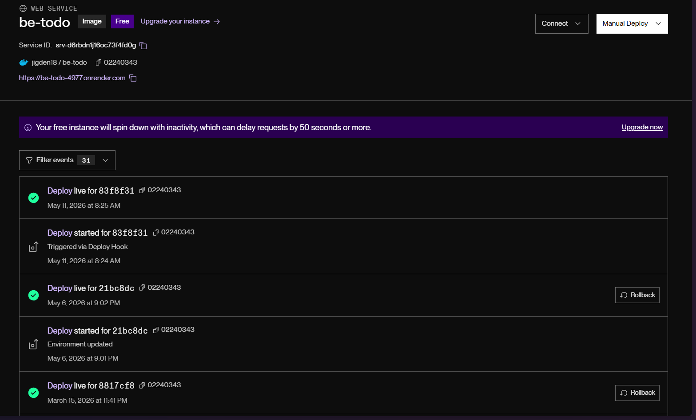
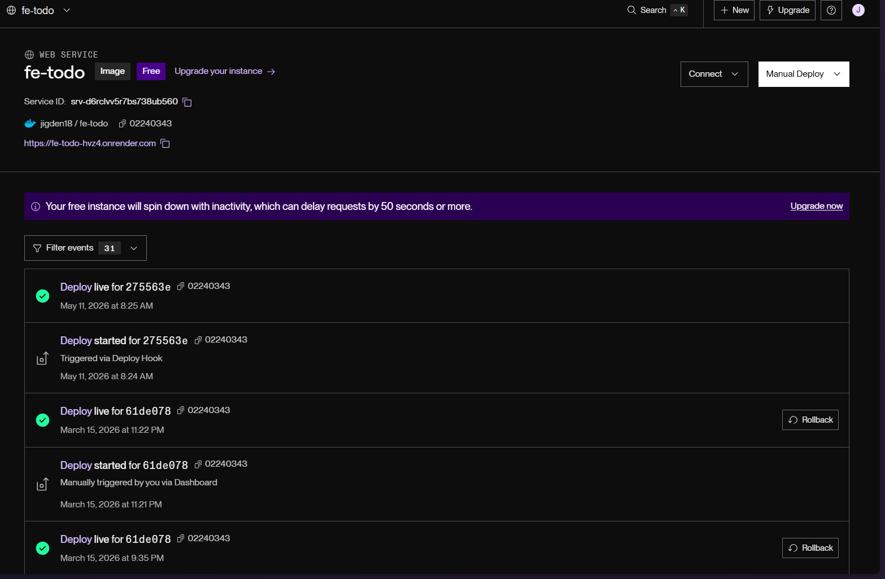
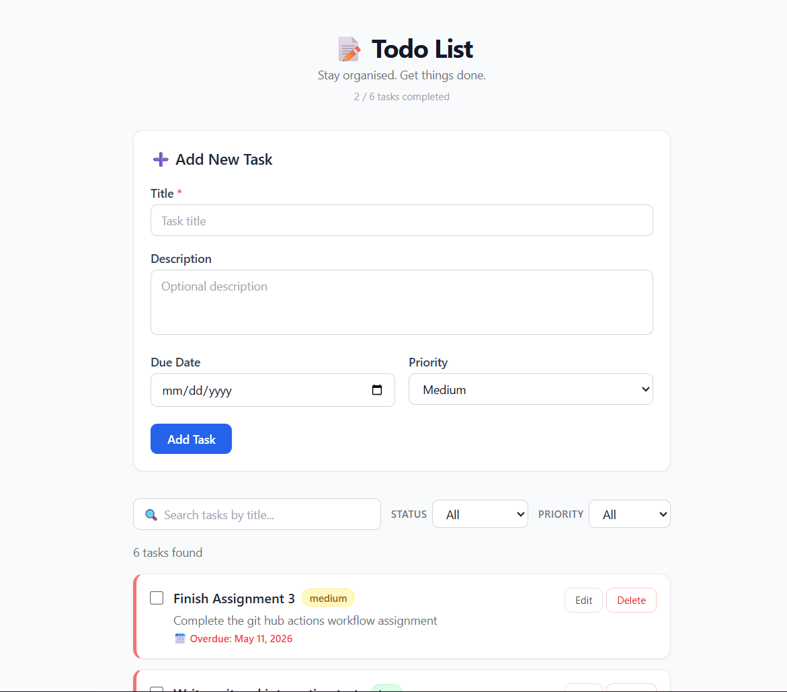
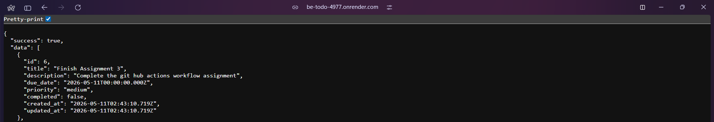

# Assignment III - Continuous Integration and Continuous Deployment (DSO101)

---

## Objectives
1. **Build** Docker containers for application components
2. **Push** containers to **DockerHub** registry
3. **Deploy** containers on **Render**

---

## Technology Stack

| Component | Purpose |
|---|---|
| GitHub | Source code hosting and version control |
| GitHub Actions | CI/CD pipeline automation |
| Docker | Application containerization |
| DockerHub | Container image registry |
| Render.com | Cloud deployment platform |
| Node.js & npm | Backend runtime & package management |
| Next.js | Frontend framework |
| Express + Prisma | Backend framework and ORM |
| Jest | Testing framework |

---

## Implementation Details

### 1. Docker Configuration

The Dockerfiles were carried over from Assignment 1 without modification, as both images were already built, tested locally, and pushed to DockerHub (`jigden18/be-todo:02240343` and `jigden18/fe-todo:02240343`).

#### Backend Service Dockerfile

```dockerfile
FROM node:18-alpine

RUN apk add --no-cache openssl

WORKDIR /app

COPY package*.json ./

RUN npm install

COPY . .

RUN npx prisma generate

EXPOSE 5000

CMD ["node", "server.js"]
```

1. Build docker image locally:
    ```bash
    docker build -t jigden18/be-todo:02240343 ./JigdenShakya_02240343_DSO101_A1/backend
    ```

2. Run docker container locally:
    ```bash
    docker run -p 5000:5000 --env-file .env jigden18/be-todo:02240343
    ```



#### Frontend Service Dockerfile

The frontend uses a multi-stage build — Stage 1 compiles the Next.js app with the backend URL baked in at build time via `ARG NEXT_PUBLIC_API_URL`, Stage 2 runs only the production output in a smaller image.

```dockerfile
# Stage 1: build the Next.js application
FROM node:20-alpine AS builder

WORKDIR /app

COPY package*.json ./

RUN npm install --legacy-peer-deps

COPY . .

# Bake the backend URL into compiled JavaScript at build time
ARG NEXT_PUBLIC_API_URL
ENV NEXT_PUBLIC_API_URL=$NEXT_PUBLIC_API_URL

RUN npm run build

# Stage 2: production runner (smaller final image)
FROM node:20-alpine AS runner

WORKDIR /app

COPY --from=builder /app/package*.json ./
COPY --from=builder /app/.next ./.next
COPY --from=builder /app/node_modules ./node_modules

EXPOSE 3000

CMD ["npm", "start"]
```

1. Build docker image:
    ```bash
    docker build \
      --build-arg NEXT_PUBLIC_API_URL=http://localhost:5000 \
      -t jigden18/fe-todo:02240343 \
      ./JigdenShakya_02240343_DSO101_A1/frontend
    ```

2. Run docker container locally:
    ```bash
    docker run -p 3000:3000 jigden18/fe-todo:02240343
    ```



---

### 2. GitHub Secrets Configuration

#### Required Secrets

| Secret Name | Description | Required For |
|---|---|---|
| `DOCKERHUB_USERNAME` | DockerHub account username | Pushing images |
| `DOCKERHUB_TOKEN` | DockerHub access token | Pushing images |
| `BACKEND_RENDER_URL` | Production backend URL | Baked into Next.js build |
| `RENDER_BACKEND_DEPLOY_HOOK` | Backend redeployment webhook | Backend updates |
| `RENDER_FRONTEND_DEPLOY_HOOK` | Frontend redeployment webhook | Frontend updates |

#### Setting Up DockerHub Secrets

1. Log in to [Docker Hub](https://hub.docker.com)
2. Navigate to **Account Settings** → **Personal access tokens**
3. Click **Generate new token**
4. Provide a descriptive name (e.g., `github-actions`)
5. Set permissions to **Read, Write, Delete**
6. Copy the generated token (won't be shown again)
7. Go to GitHub repo → **Settings** → **Secrets and variables** → **Actions**
8. Add:
   - `DOCKERHUB_USERNAME`: your DockerHub username
   - `DOCKERHUB_TOKEN`: the token you just created

#### Configuring Render Deploy Hooks

1. Go to your services in [Render Dashboard](https://dashboard.render.com)
2. Click on the frontend service `fe-todo`
3. Click **Settings** → scroll to **Deploy**
4. Click **Regenerate hook** → copy the URL
5. Repeat for backend service `be-todo`
6. Add to GitHub Secrets as `RENDER_BACKEND_DEPLOY_HOOK` and `RENDER_FRONTEND_DEPLOY_HOOK`



---

### 3. GitHub Actions Workflow

Created `.github/workflows/deploy.yml` at the repository root. The workflow triggers automatically on every push to `main`.

```yaml
name: Build and Deploy

on:
  push:
    branches: ["main"]

jobs:
  build-and-deploy:
    runs-on: ubuntu-latest

    steps:
      # 1. Checkout the repository code
      - name: Checkout Repository
        uses: actions/checkout@v4

      # 2. Log in to DockerHub
      - name: Login to DockerHub
        uses: docker/login-action@v3
        with:
          username: ${{ secrets.DOCKERHUB_USERNAME }}
          password: ${{ secrets.DOCKERHUB_TOKEN }}

      # 3. Build and push the backend image
      #    Context is ./backend so Docker uses backend/Dockerfile
      - name: Build and Push Backend Image
        run: |
          docker build \
            -t ${{ secrets.DOCKERHUB_USERNAME }}/be-todo:02240343 \
            ./JigdenShakya_02240343_DSO101_A1/backend
          docker push ${{ secrets.DOCKERHUB_USERNAME }}/be-todo:02240343

      # 4. Build and push the frontend image
      #    Pass the production backend Render URL as a build argument
      #    so Next.js bakes it into the compiled JS bundle
      - name: Build and Push Frontend Image
        run: |
          docker build \
            --build-arg NEXT_PUBLIC_API_URL=${{ secrets.BACKEND_RENDER_URL }} \
            -t ${{ secrets.DOCKERHUB_USERNAME }}/fe-todo:02240343 \
            ./JigdenShakya_02240343_DSO101_A1/frontend
          docker push ${{ secrets.DOCKERHUB_USERNAME }}/fe-todo:02240343

      # 5. Tell Render to pull the new backend image and redeploy
      - name: Trigger Backend Render Deployment
        run: |
          curl -X POST "${{ secrets.RENDER_BACKEND_DEPLOY_HOOK }}"

      # 6. Tell Render to pull the new frontend image and redeploy
      - name: Trigger Frontend Render Deployment
        run: |
          curl -X POST "${{ secrets.RENDER_FRONTEND_DEPLOY_HOOK }}"
```

#### Workflow Explanation

**Trigger**
- Automatically runs on every push to the `main` branch

**Checkout Code**
- Downloads the latest code from the GitHub repository onto the GitHub Actions runner

**DockerHub Login**
- Authenticates with DockerHub using credentials stored as GitHub Secrets — no passwords are hardcoded anywhere

**Backend Container**
1. Builds the Docker image using `backend/Dockerfile` with the full subfolder path as context
2. Pushes to DockerHub as `jigden18/be-todo:02240343`

**Frontend Container**
1. Builds the Next.js image passing `NEXT_PUBLIC_API_URL` as a build argument so the production backend URL is compiled into the JavaScript bundle
2. Pushes to DockerHub as `jigden18/fe-todo:02240343`

**Deployment**
- Triggers Render redeployment for both services via deploy hook webhooks
- Render pulls the latest image from DockerHub and restarts the service

**Successful workflow run:**



**DockerHub images pushed:**



---

### 4. Render Deployment

Two separate Render Web Services were created — one for the backend API and one for the Next.js frontend.

**Backend service:**
- URL: https://be-todo-4977.onrender.com
- Port: `5000`


**Frontend service:**
- URL: https://fe-todo-hvz4.onrender.com
- Port: `3000`


**Render redeployments triggered by webhook:**




**End-to-end verification:**




---

## Challenges Faced

### 1. Docker Container Cannot Reach `localhost` Database
When testing the containerized backend locally, Prisma threw:
```
Can't reach database server at localhost:5432
```
Docker containers run in an isolated network — `localhost` inside the container refers to the container itself, not the host machine. The fix was replacing `localhost` with `host.docker.internal` in the local `.env` file. This is Docker's special hostname on Windows and Mac that routes traffic from inside a container back out to the host PC where PostgreSQL (pgAdmin) is running.

### 2. `NEXT_PUBLIC_API_URL` Must Be Baked In at Build Time
Next.js compiles `NEXT_PUBLIC_*` environment variables into the JavaScript bundle during `npm run build` — they cannot be injected at runtime. This meant the production backend URL had to be passed as `--build-arg NEXT_PUBLIC_API_URL` during `docker build` in the GitHub Actions workflow. Setting it only as a Render environment variable would have no effect since the bundle is already compiled inside the image.

### 3. Render External vs Internal Database URL
The `.env.production` file contained the Render PostgreSQL External URL (with the full `.singapore-postgres.render.com:5432` hostname). This works from a local machine but is unreachable within Render's internal network. The fix was to use the Internal URL (short hostname, no port suffix) as the `DATABASE_URL` environment variable on the Render backend service, while keeping the External URL in `.env.production` for local testing only.

### 4. Correct Build Context Paths in GitHub Actions
Because the repo has a nested folder structure, the `docker build` context paths in `deploy.yml` had to include the full subfolder path from the repo root (`./JigdenShakya_02240343_DSO101_A1/backend`) rather than just `./backend`. This was identified by cross-referencing the paths already defined in `render.yaml`.

---

## Learning Outcomes

- Understood how GitHub Actions workflows are structured using YAML and how each step maps to a real terminal command running on a cloud Ubuntu machine.
- Learned that `NEXT_PUBLIC_*` variables in Next.js are compile-time, not runtime — requiring `--build-arg` to be passed during Docker build in CI.
- Gained hands-on experience with the difference between Docker's `localhost` (container-scoped) and `host.docker.internal` (host machine) when connecting to local services.
- Understood the difference between Render's Internal and External database URLs and when to use each.
- Learned to reuse existing Docker images from a previous assignment in a new CI/CD pipeline without modifying the Dockerfiles.
- Understood the full automated pipeline: code push → GitHub Actions triggered → images built and pushed to DockerHub → Render webhooks called → services redeployed.

---

## Links

| Resource | URL |
|---|---|
| GitHub Repository | https://github.com/Jigden18/SS2026_DSO101_02240343.git |
| Frontend (Render) | https://fe-todo-hvz4.onrender.com |
| Backend API (Render) | https://be-todo-4977.onrender.com |
| DockerHub Backend | https://hub.docker.com/r/jigden18/be-todo |
| DockerHub Frontend | https://hub.docker.com/r/jigden18/fe-todo |

